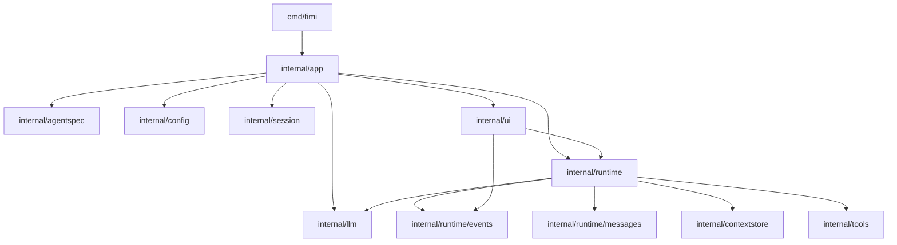

# PLAN

## Step Goal

This micro-step does two tightly related things:

1. Record the Python reference analysis from `temp/` in one place.
2. Define the first Go package skeleton we will build against.

We do only this now because the repository is still almost empty. If we start writing runtime code before fixing package boundaries, we will likely mix CLI, runtime, storage, and tools into one package and create avoidable refactors.

## Design Explanation

The Python reference project under `temp/` is not just "one agent class". It is already split into clear layers:

- bootstrap and dependency wiring
- agent spec loading
- runtime loop
- context persistence and checkpoints
- tool adapters
- UI / transport adapters

The most important design decision to preserve in Go is the separation between:

- core agent logic
- replaceable adapters

In the Python version:

- `kimi_cli/__init__.py` acts as the composition root
- `kimi_cli/agent.py` loads YAML agent specs and instantiates tools
- `kimi_cli/soul/kimisoul.py` owns the multi-step runtime loop
- `kimi_cli/soul/context.py` persists history and supports checkpoint rollback
- `kimi_cli/tools/*` are adapters
- `kimi_cli/ui/*` are adapters

The Go rewrite should keep those seams explicit.

## Python To Go Mapping

| Python Module | Go Package | Responsibility | Classification |
| --- | --- | --- | --- |
| `temp/src/kimi_cli/__init__.py` | `cmd/fimi` + `internal/app` | CLI entry and application wiring | adapter / app |
| `temp/src/kimi_cli/agent.py` | `internal/agentspec` | Load agent YAML, prompts, tool declarations | adapter / integration |
| `temp/src/kimi_cli/soul/kimisoul.py` | `internal/runtime` | Main agent loop | core agent logic |
| `temp/src/kimi_cli/soul/context.py` | `internal/contextstore` | History persistence, checkpoints, revert | core logic + infrastructure |
| `temp/src/kimi_cli/soul/event.py` | `internal/runtime/events` | Runtime event bus contract | core boundary |
| `temp/src/kimi_cli/soul/message.py` | `internal/runtime/messages` | Convert tool results into conversation messages | core support |
| `temp/src/kimi_cli/tools/*` | `internal/tools/*` | Tool implementations | adapter / integration |
| `temp/src/kimi_cli/tools/mcp.py` | `internal/tools/mcp` | MCP tool adapter | replaceable adapter |
| `temp/src/kimi_cli/config.py` | `internal/config` | Provider, model, loop config | infrastructure |
| `temp/src/kimi_cli/metadata.py` | `internal/session` | Session metadata and history locations | infrastructure |
| `temp/src/kimi_cli/utils/provider.py` | `internal/llm` | LLM provider construction | replaceable adapter |
| `temp/src/kimi_cli/ui/*` | `internal/ui/*` | Shell / print / ACP frontends | replaceable adapter |

## Proposed Initial Skeleton

```text
cmd/fimi/
internal/app/
internal/agentspec/
internal/runtime/
internal/runtime/events/
internal/runtime/messages/
internal/contextstore/
internal/tools/
internal/tools/bash/
internal/tools/fileops/
internal/tools/web/
internal/tools/task/
internal/tools/mcp/
internal/config/
internal/session/
internal/llm/
internal/ui/
internal/ui/shell/
internal/ui/printui/
internal/ui/acp/
```

Why `internal/`:

- This project is an application, not a general-purpose Go SDK.
- `internal/` makes package visibility stricter.
- It helps a beginner keep boundaries clean.

Why `cmd/fimi/`:

- In Go, the executable entrypoint normally lives under `cmd/<app-name>/`.
- This keeps `main.go` very small and prevents business logic from leaking into the process entrypoint.

## Local Module Diagram



## Global Architecture Relation

Core pieces:

- `internal/runtime`
  - core agent logic
  - stable
- `internal/contextstore`
  - core agent logic plus persistence concerns
  - stable
- `internal/runtime/events`
  - runtime/UI boundary
  - stable

Replaceable pieces:

- `internal/tools/*`
  - adapter / integration logic
  - replaceable
- `internal/llm`
  - adapter / integration logic
  - replaceable
- `internal/ui/*`
  - interface adapters
  - replaceable

Supporting infrastructure:

- `internal/config`
- `internal/session`
- `internal/agentspec`

## Design Rationale

Good design choices from the Python reference that we should preserve:

1. The runtime loop does not know how the shell UI renders things.
2. Tools are adapters, not special hardcoded branches in the loop.
3. Subagents are implemented as a tool-driven nested run, not as a separate top-level runtime mode.
4. History is persisted as an append-only log with checkpoints.

Common bad designs we should avoid:

1. One giant `agent` package that owns CLI, runtime, storage, and tools.
2. Putting file persistence directly inside the runtime loop implementation.
3. Designing a very abstract framework before the first runnable CLI skeleton exists.
4. Re-implementing Python-style dynamic reflection in Go where explicit registration is clearer.

## Next Tiny Step

The next smallest implementation step is:

1. create `go.mod`
2. create `cmd/fimi/main.go`
3. create `internal/app/app.go`

The goal of that step is only to establish a runnable entry chain:

`main -> app.Run`

No runtime loop, no tools, no storage implementation yet.
